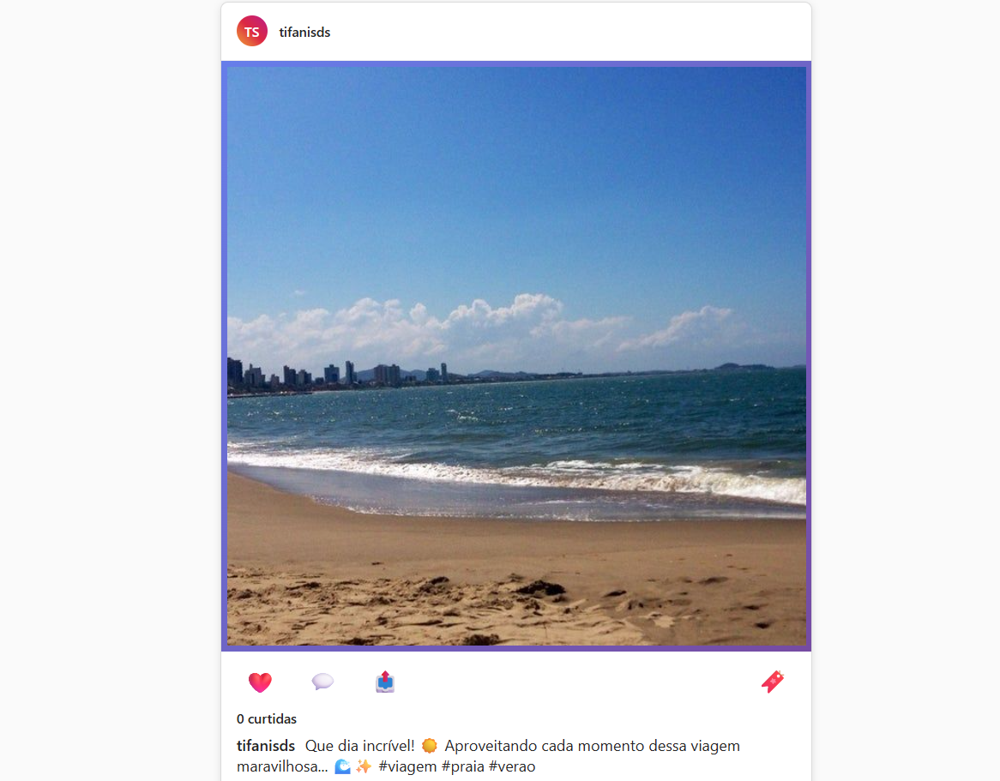
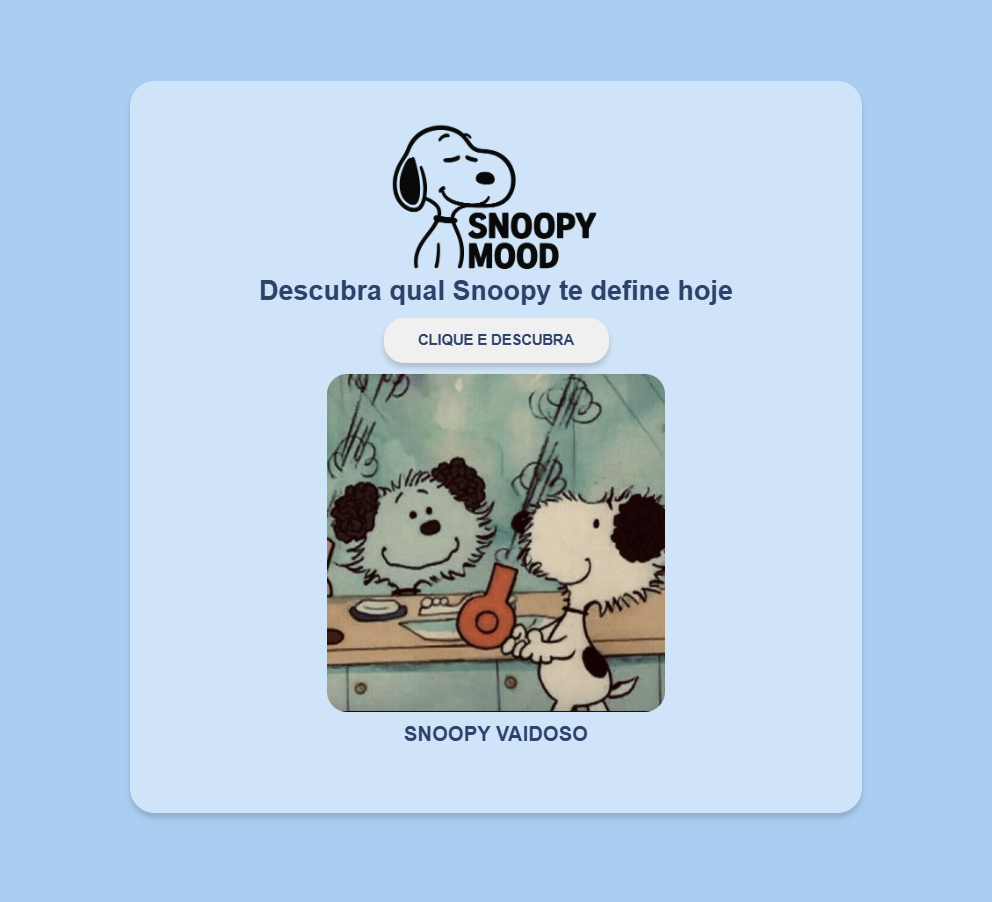
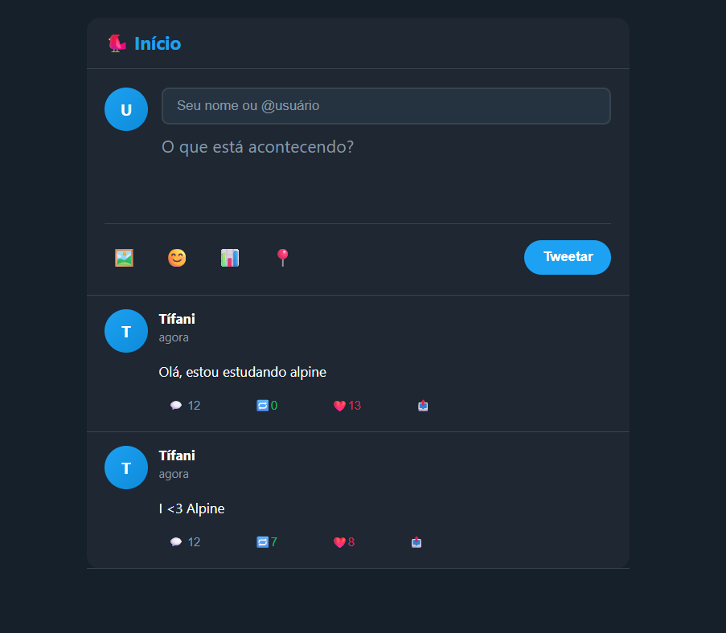
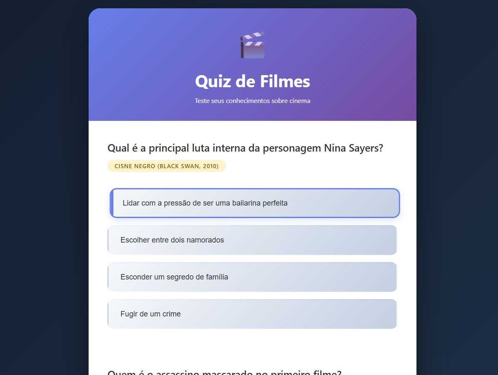
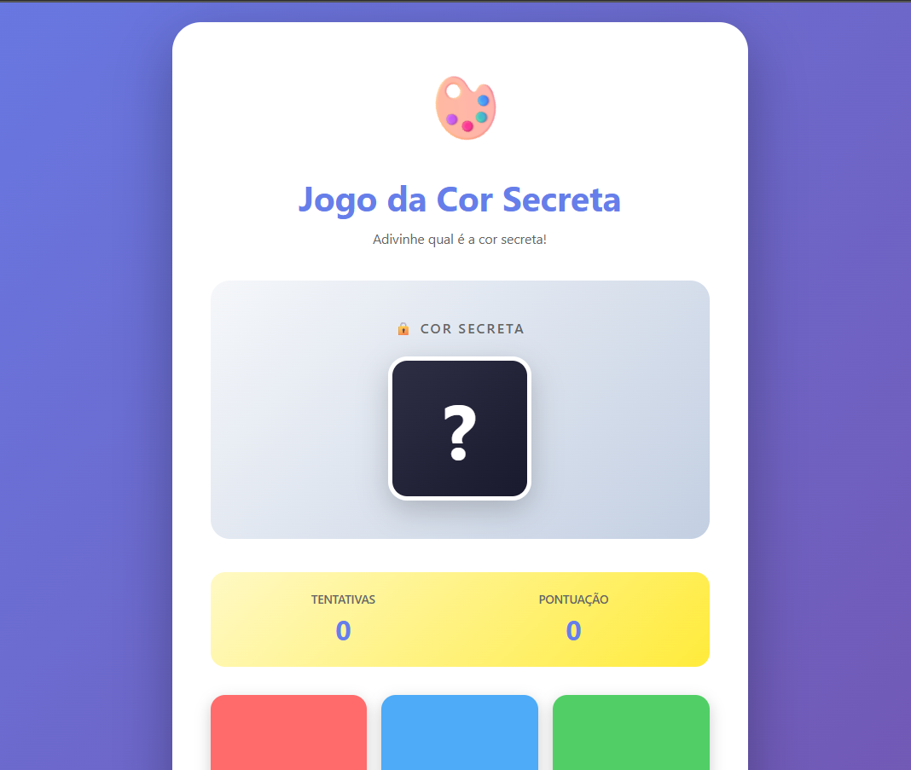

# 📚 Repositório de Estudos – JavaScript Web

Bem-vindo(a) ao meu repositório de estudos focado em **JavaScript para Web**, contendo explicações detalhadas, anotações e exercícios práticos usando **JS Vanilla** e **Alpine.js**.  
Aqui registro meus aprendizados, códigos, mini-projetos e experimentações visuais com manipulação do DOM.

---

## 🗂️ Sumário

- [Sobre o Repositório](#sobre-o-repositório)
- [Conteúdos Estudados](#conteúdos-estudados)
  - [CDN](#cdn)
  - [DOM](#dom)
  - [Falsy & Truthy](#falsy--truthy)
  - [HTTP](#http)
  - [Alpine.js](#alpinejs)
  - [Filter & Find](#filter--find)
  - [LocalStorage & SessionStorage](#localstorage--sessionstorage)
  - [Status Codes](#status-codes)
  - [Timeout & Interval](#timeout--interval)
  - [Requisições Assíncronas](#requisições-assíncronas)
- [Exercícios Práticos](#exercícios-práticos)
  - [JS Vanilla](#js-vanilla)
  - [Exercícios com Alpine.js](#exercícios-com-alpinejs)
- [Imagens dos Exercícios](#imagens-dos-exercícios)
- [Como Executar os Arquivos](#como-executar-os-arquivos)
- [Tecnologias Utilizadas](#tecnologias-utilizadas)
- [Licença](#licença)

---

## Sobre o Repositório

Este repositório reúne meus estudos sobre fundamentos e práticas essenciais do **JavaScript aplicado ao desenvolvimento web**, incluindo manipulação de DOM, lógica, eventos, armazenamento local, requisições HTTP e criação de interfaces reativas com Alpine.js.

O objetivo é servir como:
- Meu guia pessoal de estudo  
- Um conjunto de exercícios e exemplos funcionais  
- Um material público para futuras revisões e consultas  

---

## 📖 Conteúdos Estudados

### ▶️ CDN
Explicação detalhada sobre o que é uma CDN, quando usar e como importar bibliotecas diretamente via link.

### 🌳 DOM
- O que é o Document Object Model  
- Como selecionar, criar e manipular elementos  
- Eventos e interação com o usuário  

### 🔍 Falsy & Truthy
- Lista completa de valores *falsy*  
- Como o JS avalia expressões booleanas  
- Exemplos práticos  

### 🌐 HTTP
- Conceito geral  
- Métodos: GET, POST, PUT, DELETE  
- Requisições e respostas  

### ⚡ Alpine.js
- Estrutura básica  
- Diretivas comuns (`x-data`, `x-model`, `x-on`, `x-show`, etc.)
- Exemplos com manipulação de estado reativo  

### 🔎 Filter & Find
- Diferenças entre os métodos  
- Exemplos comparativos  
- Casos de uso comuns  

### 💾 LocalStorage & SessionStorage
- Diferença entre os dois  
- Métodos (`setItem`, `getItem`, `removeItem`)  
- Exemplos aplicados  

### 🧾 Status Codes
- Principais códigos HTTP (2xx, 3xx, 4xx, 5xx)  
- Significados e exemplos  

### ⏱️ Timeout & Interval
- `setTimeout` e `setInterval`  
- Cancelamento (`clearTimeout`, `clearInterval`)  
- Exemplos animados  

### 🔄 Requisições Assíncronas
- `fetch`  
- Promises  
- `async/await`  
- Tratamento de erros  

---

## Exercícios Práticos

### 🟦 JS Vanilla
Exercícios envolvendo:
- Manipulação do DOM  
- Eventos  
- Lógica de programação  
- Arrays, objetos e funções  
- Mini projetos simples  

---

### 🟡 Exercícios com Alpine.js
Exercícios visuais usando:
- Bindings reativos  
- Condicionais e loops  
- Componentes simples  
- Formulários interativos  

---

## 🖼️ Imagens dos Exercícios

> **Espaço reservado para screenshots demonstrativos.**

### Exemplo de exercício (JS Vanilla)
#### Exercicio insta com manipulação do DOM

---

#### Exercicio gerador de avatar com requisições assincronas

---

#### Exercicio gerador de fotos do snoopy

### Exemplo de exercício (Alpine.js)
#### Exercicio gerador de tweets

---
#### Exercicio quiz de filmes

---
#### Exercicio cor secreta
