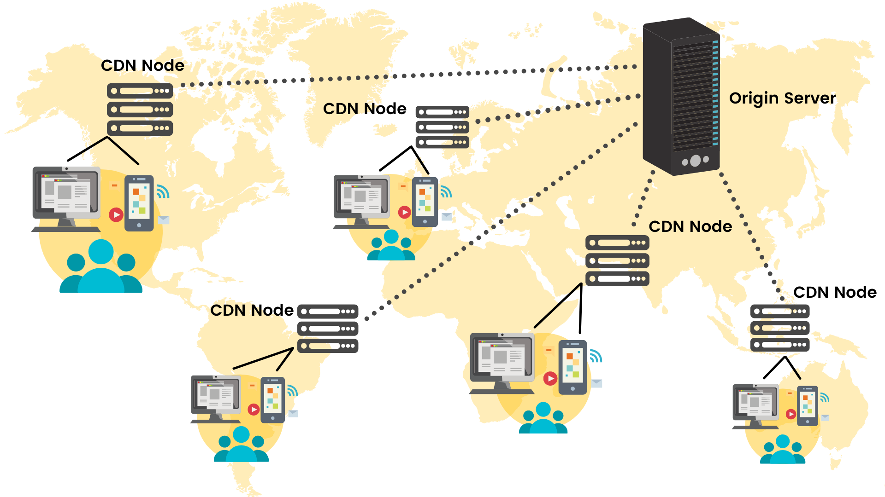
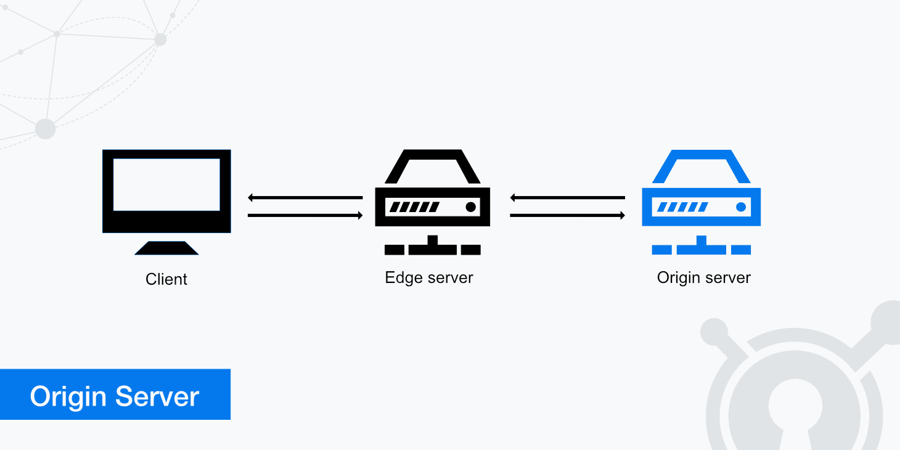

# CDN — Rede de Distribuição de Conteúdo e seu Papel na Performance Web
---
## Conceito e Finalidade
### O que é uma CDN?
CDN significa Content Delivery Network, ou em português, Rede de Distribuição de Conteúdo.
Ela é uma rede de servidores espalhados geograficamente pelo mundo, criada para entregar conteúdo da internet de forma mais rápida e eficiente para os usuários.

### Como funciona na prática
Imagine que você criou um site e hospedou todos os arquivos (imagens, vídeos, CSS, JavaScript etc.) em um único servidor, localizado em São Paulo.
Quando alguém do Brasil acessa, o site carrega rápido.
Mas se alguém acessar de Portugal ou Japão, o tempo de resposta é maior, os dados precisam viajar uma distância enorme pela internet.

É aí que entra a CDN. A CDN replica os arquivos do seu site (ou parte deles) em vários servidores ao redor do mundo. Cada servidor é chamado de “nó” ou “edge server”

Quando o usuário acessa seu site:

- Ele não baixa os arquivos do servidor original,
- e sim do servidor mais próximo fisicamente a ele (por exemplo, um servidor em Lisboa, no caso de Portugal).

### Problema que ela resolve
#### Sem CDN
- Usuário distante → maior latência (demora para os dados viajarem)
- Carregamento lento
- Mais sobrecarga no servidor principal

#### Com CDN
- Usuário recebe arquivos do servidor mais próximo → menos latência
- Carregamento mais rápido
- Menos carga no servidor original
- Melhor distribuição de tráfego (principalmente em sites grandes)
- O que significa CDN (Content Delivery Network).
- Problema que resolve: latência e lentidão no carregamento de conteúdo.

### Analogia simples:
Uma loja de roupas precisa enviar um produto para uma pessoa que está no interior da Bahia, porém, o produto será enviado de São Paulo, que é onde fica a loja fisica

Ao invés de enviar de São Paulo até o interior da Bahia, a loja poderia montar alguns pontos de distribuição ao longo do Brasil, dessa forma os produtos chegariam mais rápido na casa dos clientes.

### O que uma CDN entrega
CDNs são usadas para distribuir praticamente qualquer tipo de conteúdo estático, como:
- Imagens, ícones, vídeos, fontes
- Arquivos CSS e JavaScript
- Bibliotecas públicas (ex: React, jQuery, Bootstrap)
- Streaming de vídeo e música
- Dados de APIs com cache

## Como uma CDN Funciona
Uma CDN (Content Delivery Network) é uma rede distribuída de servidores cuja missão é entregar conteúdo ao usuário da forma mais rápida possível.
Dois papéis centrais:

- Origin Server — onde está o conteúdo “verdadeiro” (seu servidor de aplicação / storage).
- Edge Server (servidor de borda) — um servidor CDN perto do usuário que responde às requisições. Ele mantém cache de cópias do conteúdo origin.

### Passo a passo do fluxo

1 - Usuário pede um recurso (ex.: https://site.com/app.js) — o navegador resolve DNS.

2 - DNS direciona o cliente ao POP (Point of Presence) da CDN mais próximo (por latência/geografia) — normalmente usando Anycast.

3 - O edge server recebe a requisição e verifica o cache (cache lookup).
- Cache hit: o edge tem o arquivo e retorna ao cliente imediatamente.
- Cache miss: o edge busca o arquivo no origin (ou em outro layer/peer), recebe, armazena em cache, e retorna ao cliente.

4 - Nas próximas requisições para o mesmo recurso, o edge responde do cache enquanto o item estiver válido (TTL).

5 - Quando o item expira ou é invalidado, o edge faz nova solicitação ao origin.
O que estudar:

### Componentes e conceitos chave
#### Edge Server (Servidor de borda)
- Fica próximo ao usuário (geograficamente/por rede).
- Serve conteúdo cacheado, aplica otimizações (compressão, HTTP/2/3, TLS offload).
- Pode rodar lógica “no edge” (workers/functions).

#### Origin Server
- Fonte canônica do conteúdo.
- Pode ser um servidor de aplicação, um bucket S3/Blob, ou um origin custom.

#### Cache
- Local onde o edge armazena o conteúdo por um tempo (TTL).

### Cache hit x miss, e o que acontece no miss
- Hit: edge tem o objeto válido → resposta é rápida (baixa latência).
- Miss: edge solicita ao origin; isso adiciona latência (round-trip) e possivelmente aumenta carga no origin. Após receber, edge armazena e serve.

## Tipos de Conteúdo Entregues por uma CDN
### Conteúdo Estático

São arquivos que não mudam com frequência e podem ser armazenados em cache.
Exemplos:

- Imagens (.jpg, .png, .svg)
- Vídeos (.mp4, .webm)
- Arquivos CSS, JavaScript, HTML estático
- Fontes e ícones (.woff, .ttf)

Por que usar CDN aqui:
Esses arquivos são grandes e muito acessados, então distribuir em vários servidores reduz o tempo de carregamento.

### Bibliotecas Populares
CDNs também hospedam frameworks e bibliotecas que os desenvolvedores usam em seus sites.

Exemplos:
- React → https://unpkg.com/react
- Vue.js → https://cdn.jsdelivr.net/npm/vue
- Bootstrap → https://cdn.jsdelivr.net/npm/bootstrap
- jQuery → https://code.jquery.com/jquery.min.js

Vantagem:
Os navegadores já podem ter esses arquivos em cache (de outros sites), acelerando ainda mais o carregamento.

## Como Usar uma CDN no Projeto

### Diferença: arquivos locais vs arquivos via CDN
#### Arquivos locais
- O que é: você coloca os arquivos (CSS, JS, fontes, imagens) no server do seu site ou no repositório do projeto (/assets/css/style.css, /js/app.js).
- Vantagens:
    - Controle total sobre versões e deploys.
    - Não depende de terceiros (disponibilidade, política).
    - Mais fácil aplicar políticas de segurança do mesmo domínio (CSP, cookies).
- Desvantagens: 
    - Maior carga no servidor/origem.
    - Latência maior para usuários geograficamente distantes (se não usar CDN).
    - Você precisa gerenciar cache/versões.

#### Arquivos via CDN
- O que é: referenciar recursos hospedados por uma rede de distribuição (ex.: jsDelivr, unpkg, Cloudflare CDN, Google CDN).
Entrega mais rápida para usuários globalmente (edge servers).
Vantagens:
- Menos carga no seu servidor.
- Possível aproveitamento de cache compartilhado: usuário já pode ter o arquivo em cache por visita a outro site (ex.: jQuery).
- Rápida integração sem build (bom em protótipos).

Desvantagens:
- Dependência externa (downtime da CDN, política).
- Questões de privacidade (requests para domínios de terceiros).
- Risco de alteração de versão se não fixar versão.
- Precisa cuidar de integridade (SRI) e CORS.

## Vantagens e Desvantagens
| **Vantagens**                             | **Desvantagens**                              |
| ----------------------------------------- | --------------------------------------------- |
| Menor latência e carregamento mais rápido | Depende da disponibilidade da CDN             |
| Menos carga no servidor principal         | Pode ter falhas de cache                      |
| Escalabilidade automática                 | Precisa de conexão com a internet             |
| Melhora o SEO (performance)               | Menos controle sobre atualizações automáticas |
| Segurança (proteção DDoS, HTTPS gratuito) | Cuidado com versões incorretas                |

