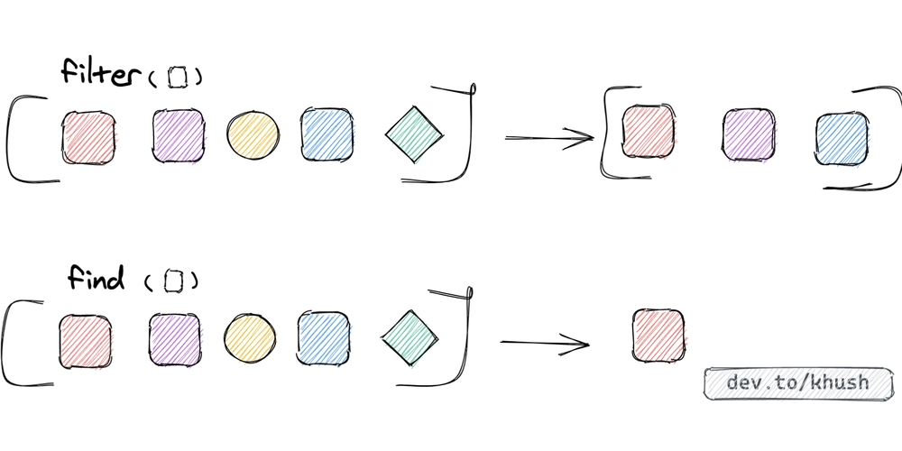

# Entendendo filter e find em JavaScript

As funções find() e filter() são métodos essenciais para a manipulação de arrays no JavaScript. Embora ambas iterem sobre um array para aplicar uma condição de teste, elas têm propósitos e resultados fundamentalmente diferentes.

## Entendendo o find()
O método find() é usado quando você espera encontrar um único elemento (ou o primeiro) que corresponda a uma condição específica.

### O que é
- O find() procura um único elemento em um array.
- Ele executa uma função de callback (uma função de teste) em cada elemento do array.
- Retorna o valor do primeiro item que satisfaça a condição (ou seja, onde a função de callback retorna true).

```js
const listaDeFrutas = ['uva', 'abacaxi', 'tangerina'];

let frutaSelecionada = listaDeFrutas.find(fruta => {
  return fruta[0] == 'u';
});

console.log(frutaSelecionada);

```

retorno:
`uva`

#### Se não tiver um valor correspondente
Caso o valor procurado não corresponda a nenhum elemento do array, o retorno será undefined
```js
const listaDeFrutas = ['uva', 'abacaxi', 'tangerina'];

let frutaSelecionada = listaDeFrutas.find(fruta => {
  return fruta[0] == 'f';
});

console.log(frutaSelecionada);

```

retorno:
`undefined`

## Entendendo o filter()
O método filter() é usado quando você precisa extrair múltiplos elementos de um array com base em uma condição.

### O que é
- O filter() filtra vários elementos com base numa condição.
- Ele executa uma função de callback (a função de teste) em todos os elementos do array.
- Retorna um novo array contendo todos os elementos para os quais a função de callback retornou true.

```js
const listaDeNomes = ['Maria', 'Tifani', 'João', 'Carlos', 'Paulo', 'Theo'];

let nomesSelecionado = listaDeNomes.filter(nome => {
  return nome.length > 4
});

console.log(nomesSelecionado);

```

retorno:
`(4) ["Maria", "Tifani", "Carlos", "Paulo...]`

#### Se não tiver um valor correspondente
Caso nenhum valor do array satisfaça a condição, o valor de retorno será um array vazio.

```js
const listaDeNomes = ['Maria', 'Tifani', 'João', 'Carlos', 'Paulo', 'Theo'];

let nomesSelecionado = listaDeNomes.filter(nome => {
  return nome.length > 10
});

console.log(nomesSelecionado);

```

retorno:
`[]`



## Diferença fundamental: find x filter

| **Característica**    | **Array.prototype.find()**                                  | **Array.prototype.filter()**                                  |
| --------------------- | ----------------------------------------------------------- | ------------------------------------------------------------- |
| **Intenção**          | Localizar o **primeiro** elemento que satisfaça a condição. | Localizar **todos** os elementos que satisfaçam a condição.   |
| **Tipo de Retorno**   | O **elemento** em si (ou `undefined`).                      | Um **novo array** com os elementos correspondentes (ou `[]`). |
| **Condição de Falha** | Retorna `undefined`.                                        | Retorna um array vazio `[]`.                                  |
| **Performance**       | Para imediatamente após encontrar o primeiro item.          | Percorre **todos** os elementos do array.                     |


