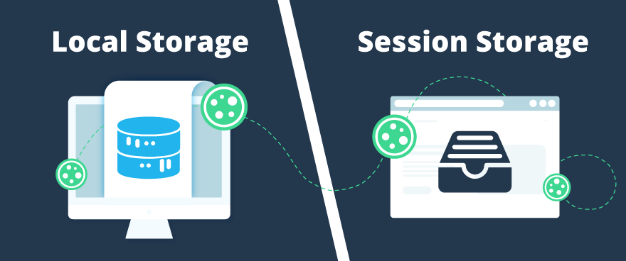

# Armazenamento Web — LocalStorage e SessionStorage
---
A API de Web Storage fornece duas maneiras de armazenar dados:

- sessionStorage mantém as informações armazenadas por origem e permanece disponível enquanto há uma sessão aberta no navegador (mesmo a página sendo recarregada). Caso o browser seja fechado a sessão será limpa e as informações serão perdidas.
- localStorage mesmo que o navegador seja fechado, os dados permanecem armazenados.

## Conceito geral de armazenamento no navegador


Quando você usa um site, o navegador pode guardar informações localmente, isto é, no seu próprio computador, e não em um servidor remoto.
Isso serve para lembrar o que o usuário fez, guardar preferências, dados de login, itens do carrinho de compras, tema escuro/claro, etc.

Esse tipo de armazenamento foi padronizado no HTML5, na chamada Web Storage API, que introduziu duas ferramentas principais:
- `localStorage`
- `sessionStorage`

## Por que o armazenamento local existe
Antes do HTML5, os sites dependiam muito do servidor para lembrar informações do usuário (por exemplo, o que havia no carrinho).
Isso tornava tudo mais lento, exigia mais processamento e uso de rede.

- Com o armazenamento local, o navegador pode:
- Guardar informações sem precisar consultar o servidor o tempo todo;
- Tornar o site mais rápido e responsivo;
- Lembrar o estado do usuário mesmo após fechar a página (no caso do localStorage);

Manter dados temporários só durante uma aba aberta (no caso do sessionStorage).
Além delas, já existiam outras formas de guardar dados, como Cookies e IndexedDB que continuam sendo importantes.

## Tipos de Armazenamento no Navegador
### Cookies
Os cookies são os mais antigos (existem desde 1994).
Eles servem para armazenar pequenos pedaços de dados e enviar automaticamente essas informações de volta ao servidor a cada requisição HTTP.
- Usados principalmente para autenticação, sessões e rastreio (como lembrar quem você é).
= São enviados junto com cada requisição — o que aumenta o tráfego e pode gerar preocupações de privacidade.
- Têm tamanho muito limitado (cerca de 4 KB por cookie).

`document.cookie = "usuario=Tifani; expires=Fri, 31 Dec 2025 23:59:59 GMT";`

### LocalStorage
Introduzido no HTML5. Serve para armazenar dados de forma persistente, ou seja, mesmo após fechar o navegador (desde que o usuário não limpe os dados do site).

- Armazena pares chave-valor (string → string).
- Cada site pode guardar cerca de 5 MB (dependendo do navegador).
- Os dados não são enviados ao servidor automaticamente.
- Ótimo para guardar preferências, tema, histórico, carrinho de compras local.

```js
localStorage.setItem("tema", "escuro");
console.log(localStorage.getItem("tema")); // "escuro"
```

### SessionStorage
Parecido com o LocalStorage, mas com vida curta:
os dados somem quando o navegador ou aba são fechados.

- Serve para guardar informações temporárias (por exemplo, dados de um formulário em andamento).
- Escopo: por aba/janela.
- Também guarda chave-valor (string).
- 5 MB por origem (geralmente).

```js
sessionStorage.setItem("etapaFormulario", "2");
console.log(sessionStorage.getItem("etapaFormulario")); // "2"

```

## LocalStorage — Fundamentos

O LocalStorage é uma API do navegador (Web Storage API) que permite armazenar dados de forma persistente no navegador do usuário, sem depender de um servidor

O LocalStorage é acessado via o objeto global localStorage, disponível no navegador.
Ele funciona como uma coleção de pares chave/valor (key → value).

| Método                               | O que faz                                       | Exemplo                                    |
| ------------------------------------ | ----------------------------------------------- | ------------------------------------------ |
| `localStorage.setItem(chave, valor)` | Armazena um dado                                | `localStorage.setItem('nome', 'Tifani')`   |
| `localStorage.getItem(chave)`        | Recupera o valor salvo                          | `localStorage.getItem('nome') // "Tifani"` |
| `localStorage.removeItem(chave)`     | Remove um item específico                       | `localStorage.removeItem('nome')`          |
| `localStorage.clear()`               | Apaga **tudo** o que está salvo no LocalStorage | `localStorage.clear()`                     |
| `localStorage.length`                | Retorna a quantidade de itens armazenados       | `localStorage.length`                      |


### Tudo é armazenado como string
Mesmo que você tente armazenar um número, objeto ou array o LocalStorage vai converter tudo para string automaticamente.

```js
localStorage.setItem('idade', 25);
console.log(localStorage.getItem('idade')); // "25" (string)

```
Por isso, quando você quer guardar objetos ou arrays, precisa usar o JSON:

### Armazenando objetos e arrays corretamente
```js
const usuario = {
  nome: 'Tifani',
  idade: 22,
  cursos: ['JS', 'PHP', 'React']
};

// Converter para string antes de salvar
localStorage.setItem('usuario', JSON.stringify(usuario));

// Ao recuperar, converter de volta para objeto
const dadosUsuario = JSON.parse(localStorage.getItem('usuario'));

console.log(dadosUsuario.nome); // Tifani

```

### Persistência
O LocalStorage é persistente, ou seja, os dados não são apagados quando o usuário fecha o navegador ou desliga o computador.

Eles apenas desaparecem se:
- O próprio código os remover (removeItem ou clear()), ou
- O usuário limpar manualmente os dados do navegador.

Portanto, o LocalStorage é ideal para guardar preferências do usuário, modo escuro, itens de carrinho, tokens temporários etc.

### Escopo
Cada domínio (ex: https://meusite.com) tem o seu próprio espaço isolado no LocalStorage.

Isso significa que:
- https://meusite.com não pode acessar o LocalStorage de https://outrosite.com.
- Subdomínios (ex: app.meusite.com) também possuem gavetas diferentes.
Essa separação garante segurança e privacidade, impedindo que sites espiem dados uns dos outros.


## SessionStorage — Fundamentos

O SessionStorage é parte da Web Storage API (HTML5), a mesma API do LocalStorage, mas foi criado para armazenar dados temporários, que devem durar apenas enquanto a aba do navegador estiver aberta.

A sintaxe é idêntica ao LocalStorage.
A única diferença está na duração e no escopo dos dados.

| Método                                 | O que faz                       | Exemplo                                       |
| -------------------------------------- | ------------------------------- | --------------------------------------------- |
| `sessionStorage.setItem(chave, valor)` | Armazena um valor               | `sessionStorage.setItem('filtro', 'ativo')`   |
| `sessionStorage.getItem(chave)`        | Recupera um valor               | `sessionStorage.getItem('filtro') // "ativo"` |
| `sessionStorage.removeItem(chave)`     | Remove um item específico       | `sessionStorage.removeItem('filtro')`         |
| `sessionStorage.clear()`               | Remove todos os itens da sessão | `sessionStorage.clear()`                      |
| `sessionStorage.length`                | Retorna quantos itens existem   | `sessionStorage.length`                       |


### Duração da sessão
O SessionStorage só existe enquanto a aba/janela estiver aberta.
Assim que a aba é fechada, o navegador apaga automaticamente todos os dados.

`sessionStorage.setItem('usuario', 'Tifani');`

- Enquanto você não fechar a aba, o valor 'Tifani' estará disponível.
- Se recarregar a página, ainda estará lá.
- Mas se fechar a aba e abrir de novo: sumiu!

### Escopo
O escopo do SessionStorage é ainda mais restrito que o LocalStorage:

| Situação                         | SessionStorage compartilha os dados? |
| -------------------------------- | ------------------------------------ |
| Mesma aba, recarregando a página | ✅ Sim                                |
| Duas abas do mesmo site          | ❌ Não                                |
| Outro domínio                    | ❌ Não                                |
| Mesma aba após fechar e reabrir  | ❌ Não                                |

- Cada aba tem sua própria instância isolada do SessionStorage.

OBS: Assim como no Localstorage, tudo é string e precisa usar JSON.stringify e JSON.parse

### Quando usar o SessionStorage?
Use o SessionStorage quando quiser armazenar dados que só fazem sentido durante a sessão atual, como:

1 - Filtros de pesquisa (por exemplo, “mostrar apenas produtos em estoque”).
→ Se o usuário fechar a aba, os filtros não precisam ser mantidos.

2 - Mensagens temporárias (alertas, status, notificações).

3 - Etapa atual de um formulário multi-páginas.
→ Se ele fechar a aba, o progresso é descartado.

### Exemplo prático: Filtro de pesquisa
Imagine uma página de produtos que salva o filtro de busca atual.

```js
<input type="text" id="filtro" placeholder="Filtrar produtos">
<button id="salvar">Salvar filtro</button>
<button id="mostrar">Mostrar filtro</button>

<script>
  const input = document.querySelector('#filtro');
  const btnSalvar = document.querySelector('#salvar');
  const btnMostrar = document.querySelector('#mostrar');

  btnSalvar.addEventListener('click', () => {
    sessionStorage.setItem('filtro', input.value);
    alert('Filtro salvo!');
  });

  btnMostrar.addEventListener('click', () => {
    alert(`Filtro atual: ${sessionStorage.getItem('filtro')}`);
  });
</script>

```
- Se você recarregar a página, o filtro ainda estará disponível
- Mas se fechar a aba e abrir outra, o filtro desaparecerá


## Diferenças entre LocalStorage e SessionStorage



| Característica   | LocalStorage                               | SessionStorage                |
| ---------------- | ------------------------------------------ | ----------------------------- |
| Persistência     | Permanente (mesmo após fechar o navegador) | Temporária (até fechar a aba) |
| Escopo           | Por domínio                                | Por aba/janela                |
| Capacidade       | ~5 a 10 MB                                 | ~5 MB                         |
| Compartilhamento | Entre abas do mesmo domínio                | Isolado por aba               |
| API              | Igual                                      | Igual                         |
