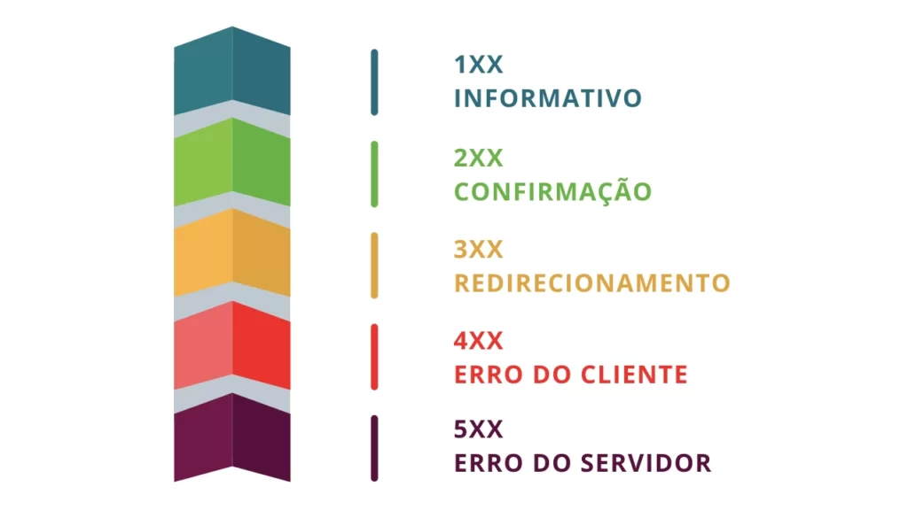
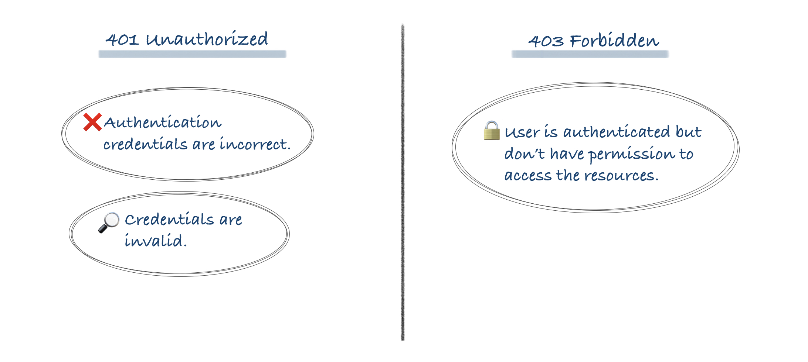

# Status Codes HTTP

## O que é um Status Code HTTP
Um Status Code (ou código de status HTTP) é um número que o servidor envia de volta para o cliente (como o navegador ou o JavaScript do seu site) para indicar como foi o resultado da requisição.

Toda vez que o cliente faz uma requisição, o servidor responde algo como:
```js
HTTP/1.1 200 OK // Versão do protocolo utilizado e numeração do status + descrição
Content-Type: application/json // Tipo de conteúdo retornado

```

## Onde o Status Code aparece?
Ele aparece em qualquer resposta HTTP. Seja ao abrir um site, consumir uma API, ou carregar um recurso (CSS, imagem etc).

Você pode vê-lo, por exemplo:
- No Console do navegador → aba Network (Rede).
- No código JavaScript, ao verificar response.status de um fetch().
- Em ferramentas como Postman, Insomnia ou cURL.

`GET https://api.github.com/users 200 OK`
Isso quer dizer que a requisição foi bem sucedida e o recurso solicitado está disponivel.

## O papel do Status Code no ciclo de uma requisição
O ciclo básico é assim:
1 - Cliente (navegador, app, ou JS) faz uma requisição:
```js
GET /produtos HTTP/1.1
Host: api.minhaloja.com

```
2 - Servidor recebe, processa e decide o que responder.

3 - Servidor envia uma resposta HTTP, que contém:
- Cabeçalhos (headers)
- Corpo (dados ou mensagem)
- o status code, indicando o resultado.
Exemplo de resposta:
```js
HTTP/1.1 404 Not Found // Versão do protocolo + status code + descrição
Content-Type: text/html // Tipo do conteúdo que deveria ser retornado

```
O cliente então sabe que o recurso /produtos não foi encontrado.

## Categorias principais de Status Codes


| Faixa numérica | Categoria        | Significado                                                                |
| :------------- | :--------------- | :------------------------------------------------------------------------- |
| **1xx**        | Informacional    | Pedido recebido, o servidor ainda está processando.                        |
| **2xx**        | Sucesso          | O pedido foi processado com sucesso e o servidor respondeu corretamente.   |
| **3xx**        | Redirecionamento | O cliente deve fazer outra ação (como acessar outra URL).                  |
| **4xx**        | Erro do cliente  | Algo na requisição está incorreto (ex: URL errada, sem permissão, etc).    |
| **5xx**        | Erro do servidor | O servidor teve um problema interno e não conseguiu concluir a requisição. |

## Status Codes de Sucesso (2xx)
Esses códigos indicam que a solicitação do cliente foi recebida, compreendida, aceita e processada com êxito pelo servidor.

| **Código** | **Nome**   | **Significado Detalhado**                                                                                                                                                                                                             | **Uso Típico**                                                                                                                                                                                                                  |
| ---------- | ---------- | ------------------------------------------------------------------------------------------------------------------------------------------------------------------------------------------------------------------------------------- | ------------------------------------------------------------------------------------------------------------------------------------------------------------------------------------------------------------------------------- |
| **200**    | OK         | Sucesso padrão. A requisição foi bem-sucedida e a resposta geralmente inclui o corpo de dados solicitado. É a resposta mais comum e genérica para sucesso.                                                                            | Usado para solicitações **GET** (retorna o recurso), **PATCH/PUT** (atualização onde se deseja retornar o recurso atualizado ou uma confirmação), e **POST** (em alguns casos, se um novo recurso não for estritamente criado). |
| **201**    | Created    | Recurso criado com sucesso. A requisição foi bem-sucedida e, como resultado, um novo recurso foi criado. A resposta deve retornar o novo recurso ou pelo menos uma referência (geralmente no cabeçalho `Location`).                   | **POST** (para criar um novo recurso) ou, raramente, **PUT** (se a requisição for usada para criar um recurso onde não existia um URI).                                                                                         |
| **204**    | No Content | Sucesso, mas sem corpo de resposta. A requisição foi processada com êxito, mas o servidor não tem conteúdo adicional para enviar no corpo da resposta (ou seja, o corpo deve estar vazio). Os cabeçalhos da resposta podem ser úteis. | Usado para operações que **não precisam retornar dados**, como **DELETE** (remoção de um recurso) ou **PUT/PATCH** (atualização de um recurso, onde não há necessidade de retornar o recurso atualizado).                       |

### 200 OK vs. 201 Created:
- Use 201 quando a ação principal da sua requisição for criar algo novo no servidor (ex.: enviar um formulário de cadastro via POST). A semântica é clara: a criação ocorreu. O corpo da resposta deve incluir o recurso recém-criado.

- Use 200 para requisições que buscam (GET) ou modificam (PUT/PATCH) um recurso existente e você deseja retornar o estado atual do recurso ou uma outra resposta relevante.

### 200 OK vs. 204 No Content:
- Ambos indicam sucesso. A diferença crucial é a presença ou ausência do corpo da resposta (payload).

- Use 200 quando o servidor tem dados para retornar ao cliente (ex.: a lista de usuários, o objeto atualizado).

- Use 204 quando a ação foi bem-sucedida, mas não há necessidade de enviar dados de volta. É comum em operações DELETE ou PUT/PATCH onde o cliente já sabe que a operação foi bem-sucedida e não precisa de confirmação adicional no corpo.

## Redirecionamentos (3xx)
Esses códigos informam ao cliente que ele precisa tomar uma ação adicional (geralmente uma nova requisição para um URL diferente) para completar a solicitação.

| **Código** | **Nome**                                  | **Significado Detalhado**                                                                                                                                                                                                                                          | **Impacto e Uso Típico**                                                                                                                                                                                                                                                     |
| ---------- | ----------------------------------------- | ------------------------------------------------------------------------------------------------------------------------------------------------------------------------------------------------------------------------------------------------------------------ | ---------------------------------------------------------------------------------------------------------------------------------------------------------------------------------------------------------------------------------------------------------------------------- |
| **301**    | Moved Permanently                         | **Redirecionamento Permanente.** Indica que o recurso solicitado foi definitivamente movido para uma nova URL. O cliente deve usar o novo endereço para futuras referências.                                                                                       | **Impacto SEO Forte:** motores de busca transferem o “valor” (link equity) da URL antiga para a nova. Navegadores e clientes armazenam em cache o novo destino permanentemente. **Uso Típico:** alteração de estrutura de URL, migração de domínio, consolidação de páginas. |
| **302**    | Found (Anteriormente *Moved Temporarily*) | **Redirecionamento Temporário.** Indica que o recurso está temporariamente em um local diferente. O cliente deve continuar usando a URL original para futuras requisições, pois o redirecionamento pode ser removido.                                              | **Impacto SEO Fraco:** motores de busca não transferem valor (link equity) de forma permanente, pois entendem que a mudança é breve. **Uso Típico:** redirecionar usuários após login (ex: `/dashboard`), testes A/B, ou durante manutenção breve de uma página.             |
| **304**    | Not Modified                              | **Recurso Não Modificado.** Não é um redirecionamento tradicional, mas um código de sucesso para otimização de cache. Retornado quando a requisição usa cabeçalhos de cache (*If-None-Match* ou *If-Modified-Since*) e o servidor detecta que o recurso não mudou. | **Performance:** informa ao cliente (navegador) para usar a cópia já armazenada em cache local, economizando largura de banda e processamento do servidor. **Uso Típico:** resposta a requisições **GET** de recursos estáticos (CSS, JS, imagens).                          |

### 301 vs. 302: Permanência e SEO
A diferença mais importante reside na intenção de permanência e como isso afeta a indexação:

- 301 (Permanente): É a mudança de endereço formal e definitiva. O cliente é instruído a nunca mais tentar o endereço antigo. Essencial para SEO.

- 302 (Temporário): É um desvio de rota momentâneo. O cliente deve continuar a tentar o endereço original na próxima vez, caso o redirecionamento já tenha sido removido.

### 301/302 vs. 304: Finalidade
- 301/302: O objetivo é mudar a localização do recurso. O cliente fará uma nova requisição (seguimento) para o novo URL fornecido pelo servidor.

- 304: O objetivo é evitar a transferência de dados. A requisição do cliente foi bem-sucedida (o recurso existe e está acessível), mas o servidor confirma que o cliente já possui a versão mais recente em cache. Não há nova requisição de recurso; o cliente apenas carrega a cópia local.


## Erros do Cliente (4xx)
Esses códigos indicam que a requisição contém sintaxe incorreta ou não pode ser satisfeita pelo servidor por algum motivo que é, presumivelmente, culpa do cliente (navegador, aplicativo, etc.).

| **Código** | **Nome**           | **Significado Detalhado**                                                                                                                                   | **Diferença Chave**                                                                                                                                    | **Exemplo de Uso**                                                                                                                           |
| ---------- | ------------------ | ----------------------------------------------------------------------------------------------------------------------------------------------------------- | ------------------------------------------------------------------------------------------------------------------------------------------------------ | -------------------------------------------------------------------------------------------------------------------------------------------- |
| **400**    | Bad Request        | O servidor não conseguiu entender ou processar a requisição devido a uma sintaxe inválida, formato incorreto ou dados que não atendem às regras de negócio. | É um erro genérico para qualquer problema estrutural ou de validação não relacionado à autenticação/permissão.                                         | O cliente envia uma data em formato inválido ou omite um campo obrigatório no JSON de um POST.                                               |
| **401**    | Unauthorized       | A requisição exige autenticação (credenciais válidas) e o cliente não as forneceu ou as forneceu incorretamente.                                            | **Autenticação falhou:** o cliente é um “desconhecido” ou suas credenciais são inválidas. A resposta geralmente inclui o cabeçalho `WWW-Authenticate`. | Tentar acessar um recurso que requer login sem enviar um token de sessão válido no cabeçalho.                                                |
| **403**    | Forbidden          | A requisição é válida e o cliente está autenticado, mas ele não tem as permissões necessárias para acessar o recurso.                                       | **Autorização falhou:** o cliente é “conhecido”, mas não tem o papel (role) certo.                                                                     | Um usuário comum logado tenta executar uma operação reservada apenas a administradores.                                                      |
| **404**    | Not Found          | O recurso solicitado (URL) não foi encontrado no servidor.                                                                                                  | O recurso simplesmente não existe no caminho especificado.                                                                                             | Tentar um GET para `/users/999` quando o usuário de ID 999 não existe, ou digitar a URL incorretamente.                                      |
| **405**    | Method Not Allowed | O URI especificado é reconhecido, mas o método HTTP (GET, POST, PUT, DELETE etc.) usado não é permitido para este recurso.                                  | A URL está correta, mas a operação tentada é incorreta. A resposta deve incluir o cabeçalho `Allow` listando os métodos suportados.                    | Tentar fazer um DELETE em um endpoint `/search` que só permite GET.                                                                          |
| **408**    | Request Timeout    | O servidor demorou muito esperando o cliente completar o envio da requisição e decidiu fechar a conexão.                                                    | Não é um erro de dados, mas sim um erro de tempo de conexão. Pouco comum em APIs REST.                                                                 | O cliente é muito lento e o servidor encerra a conexão antes de receber todos os dados.                                                      |
| **429**    | Too Many Requests  | O cliente enviou muitas requisições em um determinado período de tempo (limitação de taxa — *rate limiting*).                                               | Erro de controle de frequência, usado para proteger o servidor contra abuso ou sobrecarga.                                                             | Uma aplicação envia 100 requisições por segundo para uma API que limita a 10 por segundo. A resposta deve incluir o cabeçalho `Retry-After`. |

### Diferença Crítica: 401 (Unauthorized) vs. 403 (Forbidden)
- 401 Unauthorized (Autenticação)
    - Pergunta: Quem é você?
    - Cenário: Você não forneceu nenhuma credencial (token) ou forneceu credenciais expiradas/inválidas.
    - Solução: Faça login novamente ou anexe as credenciais válidas à requisição.

- 403 Forbidden (Autorização)
    - Pergunta: O que você tem permissão para fazer?
    - Cenário: O servidor sabe quem você é (você está logado), mas seu perfil/função não tem direitos de acesso para o recurso solicitado.
    - Solução: As credenciais estão corretas, mas o perfil do usuário precisa ser alterado para obter o acesso.



## Erros do Servidor (5xx)
Esses códigos de erro sinalizam que o servidor falhou ao cumprir uma requisição aparentemente válida. Eles geralmente exigem intervenção da equipe de desenvolvimento ou operações.

| **Código** | **Nome**              | **Significado Detalhado**                                                                                                             | **Causas Comuns**                                                                                                                       | **Solução / Ação Típica**                                                                                                                                                                    |
| :--------: | :-------------------- | :------------------------------------------------------------------------------------------------------------------------------------ | :-------------------------------------------------------------------------------------------------------------------------------------- | :------------------------------------------------------------------------------------------------------------------------------------------------------------------------------------------- |
|   **500**  | Internal Server Error | Erro interno e genérico. O servidor encontrou uma condição inesperada que o impediu de atender à requisição.                          | Erros de código (ex: exceções não tratadas), falhas de conexão com o banco de dados, configuração incorreta do servidor.                | O desenvolvedor deve verificar os logs do servidor para identificar a exceção e corrigi-la.                                                                                                  |
|   **501**  | Not Implemented       | O servidor não reconhece o método da requisição (ex: GET, POST) ou carece da funcionalidade para atendê-la.                           | O endpoint foi exposto, mas o código para lidar com o método específico (como PUT ou DELETE) ainda não foi escrito ou configurado.      | A equipe de desenvolvimento precisa implementar o método ou configurar o servidor para retornar 405 Method Not Allowed se o método for conhecido, mas proibido.                              |
|   **502**  | Bad Gateway           | O servidor atuando como gateway ou proxy recebeu uma resposta inválida de um servidor upstream (servidor de origem ou outro serviço). | Erros em load balancers, proxies reversos (como Nginx ou Apache), ou falhas de comunicação entre serviços.                              | Investigar a comunicação entre o proxy e o servidor de origem. O problema é geralmente de rede ou configuração de infraestrutura.                                                            |
|   **503**  | Service Unavailable   | O servidor não está apto a lidar com a requisição no momento, geralmente devido a uma sobrecarga ou manutenção.                       | O servidor está muito ocupado, o pool de conexões do banco de dados está esgotado, ou o serviço está em deploy (manutenção programada). | A resposta geralmente inclui um cabeçalho `Retry-After`, indicando quando o cliente deve tentar novamente. A equipe de operações deve aumentar a capacidade ou aguardar o fim da manutenção. |
|   **504**  | Gateway Timeout       | O servidor, atuando como gateway ou proxy, não recebeu uma resposta em tempo hábil do servidor upstream (servidor de origem).         | O servidor de origem demorou muito para processar a requisição e o proxy/gateway atingiu seu timeout.                                   | Investigar a latência do servidor de origem e os tempos de timeout configurados no gateway/proxy. Diferente do 502, aqui a falha é por lentidão, não por uma resposta inválida.              |

### Entendendo a Dinâmica dos Erros de Infraestrutura (502, 503, 504)
Os códigos 502, 503 e 504 estão intimamente ligados à arquitetura moderna, onde há múltiplos servidores (proxies, gateways, load balancers) entre o cliente e a aplicação real.

1 - 502 Bad Gateway: O erro acontece depois que o gateway se comunica com o servidor de origem, mas recebe algo que ele não consegue entender como uma resposta HTTP válida (ex: a conexão foi encerrada abruptamente).

2 - 503 Service Unavailable: O servidor intermediário ou a própria aplicação sabe que não pode atender. É frequentemente usado para throttling (redução da taxa de requisições) ou durante um deployment. É um erro que o servidor espera e comunica ativamente.

3 - 504 Gateway Timeout: O erro acontece porque o servidor de origem demorou muito (mais do que o limite de timeout configurado) para começar a responder ao gateway. É um problema de latência ou processamento longo.


## Resumo geral

|         **Classe**         | **Código** | **Nome**              | **Resumo da Ação / Significado**                                           | **Uso Típico (Método)**     | **💡 Dica Rápida**               |
| :------------------------: | :--------: | :-------------------- | :------------------------------------------------------------------------- | :-------------------------- | :------------------------------- |
|      **2xx (Sucesso)**     |   **200**  | OK                    | Sucesso padrão com corpo de resposta (dados).                              | `GET`, `PUT`, `PATCH`       | Tudo certo.                      |
|                            |   **201**  | Created               | Sucesso, e um novo recurso foi criado.                                     | `POST`, `PUT` (criação)     | Criado com sucesso.              |
|                            |   **204**  | No Content            | Sucesso, mas sem corpo de resposta (sem dados para retornar).              | `DELETE`, `PUT`, `PATCH`    | Sucesso, mas nada a retornar.    |
| **3xx (Redirecionamento)** |   **301**  | Moved Permanently     | Recurso movido permanentemente. Cacheado.                                  | Redirecionamento de URL     | Mudei de endereço (pra sempre).  |
|                            |   **302**  | Found                 | Recurso movido temporariamente. Não cacheado.                              | Redirecionamento temporário | Mudei de endereço (por agora).   |
|                            |   **304**  | Not Modified          | O cliente pode usar a cópia em cache (o recurso não mudou).                | Otimização de `GET`         | Nem precisa pedir, está igual.   |
|  **4xx (Erro do Cliente)** |   **400**  | Bad Request           | Requisição inválida (sintaxe, dados, validação).                           | Qualquer método             | Sintaxe errada, cheque os dados. |
|                            |   **401**  | Unauthorized          | Não autenticado. Credenciais ausentes ou inválidas.                        | Qualquer método             | Você não está logado.            |
|                            |   **403**  | Forbidden             | Não autorizado. Credenciais válidas, mas sem permissão.                    | Qualquer método             | Você não pode entrar aqui.       |
|                            |   **404**  | Not Found             | O recurso solicitado não existe.                                           | `GET`, `DELETE`             | Isso não existe.                 |
|                            |   **405**  | Method Not Allowed    | O método HTTP (ex: DELETE) não é permitido para este recurso.              | `POST`, `PUT`, `DELETE`     | Método errado para o recurso.    |
|                            |   **429**  | Too Many Requests     | Cliente excedeu o limite de requisições (rate limiting).                   | Qualquer método             | Calma, você pediu demais!        |
| **5xx (Erro do Servidor)** |   **500**  | Internal Server Error | Erro genérico e inesperado no servidor (código quebrou).                   | Qualquer método             | Explodiu aqui dentro!            |
|                            |   **502**  | Bad Gateway           | Servidor intermediário recebeu resposta inválida.                          | Qualquer método             | Proxy recebeu resposta ruim.     |
|                            |   **503**  | Service Unavailable   | Servidor sobrecarregado ou em manutenção.                                  | Qualquer método             | Estou fora do ar.                |
|                            |   **504**  | Gateway Timeout       | Servidor intermediário não recebeu resposta a tempo do servidor de origem. | Qualquer método             | Demorou demais pra responder.    |
