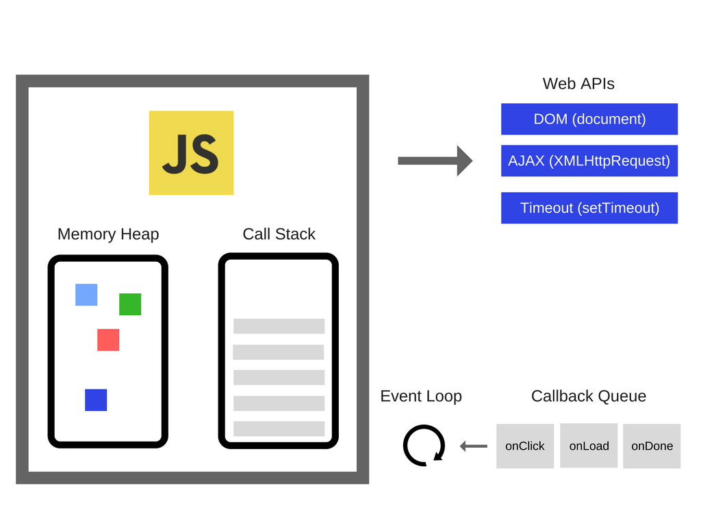
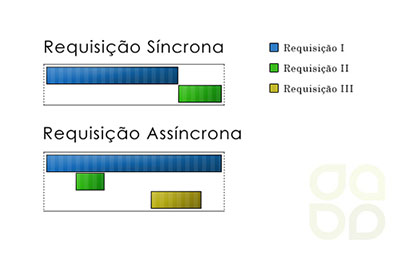
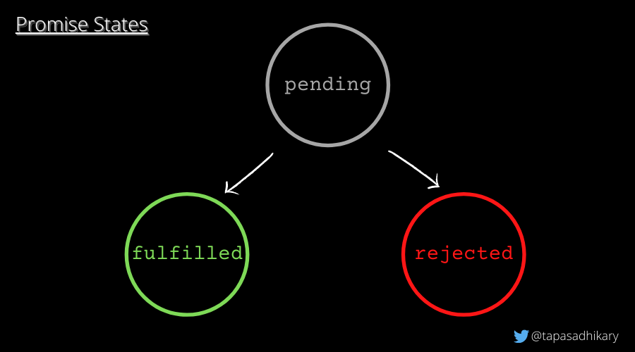

# Requisições assíncronas em JavaScript — Promises, async/await, fetch e Padrões Avançados

# Fundamentos do assíncrono em JavaScript
## O JavaScript é Single-Threaded
Isso significa que o JavaScript só faz uma coisa por vez.
Ele tem apenas uma thread principal de execução, chamada de main thread.

Mas isso não quer dizer que ele trabalha sozinho, quando falamos que o javascript é single thread, estamos nos referindo ao motor JavaScript (Javascript engine), como:
- V8 (usado no Chrome e no Node.js)
- SpiderMonkey (Firefox)
- JavaScriptCore (Safari)

Esse motor tem apenas uma thread de execução, ou seja, só consegue executar uma coisa por vez dentro da Call Stack.

## Call Stack — a pilha de execução
A Call Stack (pilha de chamadas) é onde o JavaScript coloca tudo o que precisa executar agora. Ele se baseia no conceito “FILO” — First In, Last Out
    EXEMPLO:
```js
function saudacao() {
  console.log("Oi!");
}
function iniciar() {
  saudacao();
  console.log("Tudo bem?");
}
iniciar();
```
A execução ocorre na seguinte ordem:

1 - Iniciar entra na pilha

2 - Iniciar chama saudação

3 - Saudação entra na pilha

4 - Saudação retorna uma resposta e sai da pilha 

5 - Iniciar retorna uma resposta e sai da pilha

6 - FIM



## Problemática dessa abordagem:
Vamos imaginar que queremos executar o seguinte código:
```js
console.log("Início");
fetch("https://api.exemplo.com/dados");
console.log("Fim");
```
O fetch está esperando a resposta da api porém ela esta demorando e bloquando todo resto da aplicação. Isso é conhecido como blocking: "Uma tarefa impede que outras sejam executadas até terminar."

Mas o javascript é não bloqueante, ou seja, non-blocking graças ao seu modelo assíncrono.
Ele pede para outro mecanismo executar uma tarefa lenta como o fetch, enquanto o JavaScript continua rodando o resto do código sem ficar travado.
o JavaScript engine roda dentro de um ambiente maior, que oferece mecanismos externos para ajudá-lo a lidar com tarefas demoradas.

### Esses mecanismos dependem do ambiente
| Ambiente | Mecanismos externos disponíveis | Exemplos de tarefas |
|-----------|-----------|-----------|
| **Navegador (Browser)** | Web APIs | setTimeout, fetch, DOM events, geolocation, FileReader |
| **Node.js** | C++ APIs + libuv | acesso a arquivos, rede, timers, operações de I/O |

Esses mecanismos são multi-threaded, ou seja, conseguem executar tarefas em paralelo ao código JavaScript principal.

Como o JavaScript “pede ajuda”:
```js
console.log("Início");

setTimeout(() => {
  console.log("Executado depois de 2s");
}, 2000);

console.log("Fim");
```

Passo a passo:
1- A Call Stack executa console.log("Início").
→ imprime “Início”.

2 - Quando chega em setTimeout(...), o engine JavaScript reconhece:
“Opa, isso é uma Web API, eu não sei esperar 2 segundos.” Então ele passa essa tarefa pro navegador, através da Web API Timer. Essa é a “delegação”: o JavaScript entrega a tarefa a outro sistema (o navegador).

3 - O navegador conta os 2 segundos em outra thread, fora da Call Stack.

4 - Quando o tempo termina, a Web API diz:
“Pronto, pode executar esse callback quando der.” E o coloca na Task Queue (fila de tarefas).

5 - O Event Loop observa:
“A Call Stack está vazia agora?"
Se sim, ele pega o callback da fila e coloca de volta na Call Stack.

6 - O código dentro do setTimeout é executado:
→ imprime “Executado depois de 2s”.

## Bloqueante e Não bloqueante (Resumo visual)
| Tipo | O que acontece | Exemplo |
|-----------|-----------|-----------|
| **Bloqueante** | O código para tudo e espera a tarefa terminar | while(true) {} ou funções muito pesadas |
| **Não bloqueante** | O código segue e lida com o resultado depois (callback, promise, async/await) | fetch(), setTimeout() |


# Callbacks
Em JavaScript, uma função de callback é uma função que você passa como argumento para outra função, com a intenção de que ela seja executada depois que a primeira terminar o que precisa fazer.

EXEMPLO:
```js
function cumprimentar(nome, callback) {
  console.log("Olá, " + nome); // o nome será impresso "Olá, Tífani"
  callback(); // aqui o callback é chamado e irá imprimir "Tchau!"
}

function despedir() {
  console.log("Tchau!");
}

cumprimentar("Tifani", despedir);
```

SAÍDA:
```bash
Olá, Tifani
Tchau!
```

## Callbacks assíncronos
Callbacks são muito usados em operações assíncronas, coisas que demoram, como:
- Ler arquivos
- Fazer requisições HTTP
- Esperar um tempo (setTimeout)

```js
console.log("Início");

setTimeout(() => { //A função está sendo passada como parametro dentro do setTimeout
  console.log("Isso acontece depois de 2 segundos");
}, 2000);

console.log("Fim");

```

SAÌDA:
```bash
Início
Fim
Isso acontece depois de 2 segundos
```

# Promises
## Conceito de sincrono e assincrono
A palavra síncrono vem do grego sýn (junto) + khrónos (tempo), e significa “que acontece ao mesmo tempo”.
Algo síncrono é realizado de forma simultânea ou coordenada, seguindo uma ordem temporal direta uma ação começa e só depois outra é iniciada.

Já assíncrono tem o prefixo “a-”, que indica negação. Assim, assíncrono significa “fora do mesmo tempo” ou “não simultâneo”.
Ou seja, são ações que não dependem de uma sequência rígida: uma pode ocorrer enquanto outra ainda está em andamento, ou em momentos diferentes.

em resumo:
- Síncrono = ao mesmo tempo / em sequência ordenada.
- Assíncrono = fora de sincronia / em tempos diferentes.



## O problema que as Promises resolveram
Antes das Promises, o JavaScript só tinha callbacks para lidar com tarefas assíncronas.
Mas conforme o código crescia, isso gerava o famoso callback hell:

```js
pegarDadosDoUsuario(1, (usuario) => {
  pegarPosts(usuario.id, (posts) => {
    pegarComentarios(posts[0].id, (comentarios) => {
      console.log("Comentários:", comentarios);
    });
  });
});
```
Isso fica difícil de ler, manter e tratar erros.
Então surgiram as Promises, que deixam tudo mais organizado, previsível e fácil de encadear.

## O que é uma Promise?
Uma Promise (em português, “promessa”) representa um valor que ainda não está disponível, mas estará em algum momento no futuro.

Ela serve para encapsular uma operação assíncrona e lidar com o resultado quando estiver pronto, sem travar o fluxo do código.

## Estados de uma Promise
Uma Promise pode estar em três estados:

| Estado | Estado | 
|-----------|-----------|
| **pending** | A operação ainda está em andamento (promessa pendente). | 
| **fulfilled** | A operação foi concluída com sucesso — o valor está disponível. |
| **rejected** | A operação falhou — ocorreu um erro. |



## Criando uma Promise
A sintaxe básica é:
```js
const minhaPromise = new Promise((resolve, reject) => { //Criando uma nova promise e passando a solução ou rejeição por parametro
  // operação assíncrona aqui...

  let sucesso = true;

  if (sucesso) {
    resolve("Deu certo!"); // Promessa cumprida
  } else {
    reject("Algo deu errado."); // Promessa rejeitada
  }
});

```
- resolve() → chama quando a operação termina com sucesso
- reject() → chama quando ocorre um erro

## Consumindo Promises
Uma Promise não faz nada até você “escutá-la”.
Para isso, usamos os métodos consumidores:

### .then()
Executa quando a Promise é resolvida.

### .catch()
Captura o erro

### .finally()
Executa sempre, independentemente do resultado (sucesso ou falha).

```js
minhaPromise
  .then((resultado) => {
    console.log("Sucesso:", resultado);
  })
  .catch((erro) => {
    console.log("Erro:", erro);
  })
  .finally(() => {
    console.log("Operação finalizada!");
  });

```

Exemplo prático
```js
//Criando a promise
function buscarUsuario(id) {
  return new Promise((resolve, reject) => {
    console.log("Buscando usuário...");

    setTimeout(() => {
      if (id === 1) {
        resolve({ id: 1, nome: "Tifani" });
      } else {
        reject("Usuário não encontrado!");
      }
    }, 2000);
  });
}

// Consumindo a Promise
buscarUsuario(1)
  .then((usuario) => {
    console.log("Usuário encontrado:", usuario);
  })
  .catch((erro) => {
    console.error("Erro:", erro);
  })
  .finally(() => {
    console.log("Busca concluída!");
  });

```


# async / await
Essas duas palavras-chave foram introduzidas no JavaScript para facilitar o trabalho com código assíncrono, tornando-o mais legível e fácil de entender do que o uso direto de Promises com .then() e .catch().

Antes, para lidar com Promises, o código costumava ficar assim:

```js
fetch('https://jsonplaceholder.typicode.com/posts/1')
  .then(response => response.json())
  .then(data => console.log(data))
  .catch(error => console.error(error));

```

Isso funciona, mas fica difícil de ler quando há muitas operações encadeadas.

Com async e await, o mesmo código pode ser escrito de forma sequencial, limpa e fácil de entender:

```js
async function buscarPost() {
  try {
    const response = await fetch('https://jsonplaceholder.typicode.com/posts/1');
    const data = await response.json();
    console.log(data);
  } catch (error) {
    console.error(error);
  }
}

```

## O que é async
A palavra-chave async é usada para declarar uma função assíncrona.
Quando você coloca async antes de uma função, ela sempre retorna uma Promise, mesmo que você não use return.

```js
async function saudacao() {
  return "Olá, Tifani!";
}

saudacao().then(mensagem => console.log(mensagem));
// → "Olá, Tifani!"

```
Aqui, mesmo que o retorno pareça ser uma simples string, na verdade o JavaScript o encapsula dentro de uma Promise resolvida automaticamente (Promise.resolve("Olá, Tifani!")).

## O que é await
A palavra-chave await só pode ser usada dentro de funções async, e serve para “pausar” a execução da função até que uma Promise seja resolvida ou rejeitada.

É como se dissesse: “Espere esse resultado antes de continuar.”

```js
async function carregarDados() {
  console.log("Buscando dados...");
  const resposta = await fetch('https://jsonplaceholder.typicode.com/users/1'); //Deverá obter essa resposta antes de continuar
  const usuario = await resposta.json(); //Deverá esperar essa resposta antes de continuar
  console.log("Usuário carregado:", usuario.name);
}

carregarDados();

```

## ratando erros com try...catch
Como await pode falhar (por exemplo, se o servidor estiver fora do ar), é importante tratar erros com try...catch:

```js
async function carregarDados() {
  try { // Vai tentar resolver a promise
    const resposta = await fetch('https://jsonplaceholder.typicode.com/users/10000');
    const usuario = await resposta.json();
    console.log(usuario);
  } catch (erro) { // Caso não seja possível resolver a promise, uma mensagem de erro será exibida na tela
    console.error("Erro ao carregar:", erro);
  }
}

```

## Executar Promises em paralelo
Às vezes, você não quer esperar uma por uma, e sim executar todas ao mesmo tempo para ser mais rápido.

```js
async function carregarEmParalelo() {
  const promessas = [
    fetch('https://jsonplaceholder.typicode.com/posts/1'),
    fetch('https://jsonplaceholder.typicode.com/posts/2')
  ];

  //Aqui, as duas requisições são feitas ao mesmo tempo, e o código só continua quando todas terminarem.

  const respostas = await Promise.all(promessas);
  const dados = await Promise.all(respostas.map(r => r.json()));

  console.log(dados);
}

```

resumo:
| Palavra | O que faz | Importante lembrar |
|-----------|-----------|----------|
| **async** | Define uma função que sempre retorna uma Promise | Torna possível usar await dentro da função |
| **await** | Pausa a execução até uma Promise ser resolvida | Só pode ser usada dentro de funções async |
| **try/catch** | Trata erros dentro de funções async | Substitui o uso de .catch() das Promises |
| **Promise.all()** | Executa várias Promises em paralelo | Útil para ganhar desempenho |


# fetch API (navegador)
A Fetch API é uma interface nativa do JavaScript (disponível nos navegadores modernos) usada para fazer requisições HTTP, ou seja, buscar ou enviar dados para um servidor.
O que estudar

A sintaxe mais simples do fetch é:
```js
fetch(url, opções);
```

Por padrão, o fetch() faz uma requisição GET, mas você pode personalizar o método, cabeçalhos e corpo usando o segundo parâmetro (um objeto de configuração).

Exemplo simples:
```js
fetch('https://jsonplaceholder.typicode.com/posts/1')
  .then(response => response.json())
  .then(data => console.log(data));

```

- Faz uma requisição GET à URL indicada.
- Quando a resposta chega, o response.json() lê o corpo da resposta e o transforma em objeto JavaScript.
- Depois, os dados são exibidos no console.

Estrutura geral da requisição
```js
fetch('https://api.exemplo.com/usuarios', {
  method: 'POST',
  headers: {
    'Content-Type': 'application/json'
  },
  body: JSON.stringify({
    nome: 'Tifani',
    idade: 19
  })
});

```

# Próximos assuntos...
- Abordagens de timeout e cancelamento
- Tratamento de erros robusto
- FormData, uploads e multipart
- 

