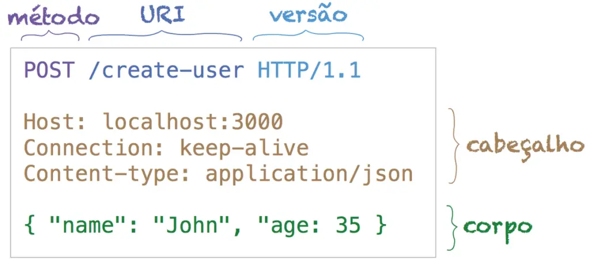
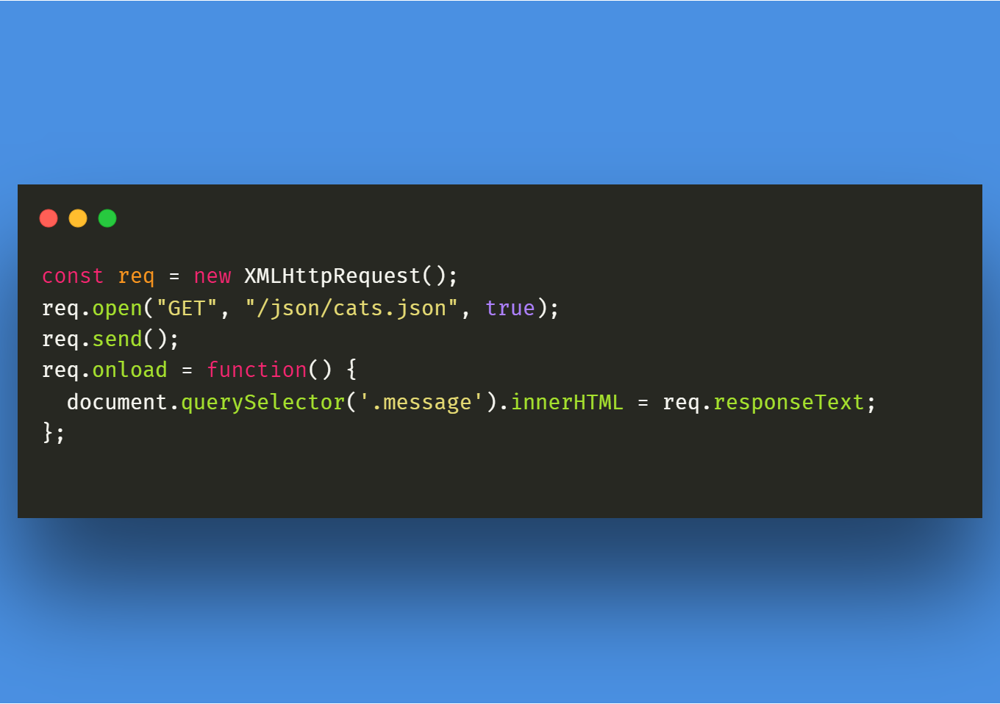

# Requisições Externas em JavaScript: Fetch, XMLHttpRequest e Axios

## Fundamentos das Requisições HTTP
HTTP (HyperText Transfer Protocol) é o protocolo de comunicação da Web — ou seja, é o conjunto de regras que define como o navegador (cliente) e o servidor trocam informações.

### O que é uma “requisição HTTP”
Uma requisição HTTP é um pedido que o cliente faz ao servidor para obter ou enviar dados.

Por exemplo:
- Quando você entra em https://meusite.com, seu navegador envia uma requisição para o servidor do site.
- O servidor então responde com o conteúdo (HTML, CSS, JS, imagens, etc.).

Essa troca é composta por duas partes principais:

1 - Request (requisição) — enviada pelo cliente.

2 - Response (resposta) — devolvida pelo servidor.

### Estrutura de uma Requisição HTTP
Uma requisição é composta por quatro partes principais:

| Parte                    | Descrição                                   | Exemplo                                 |
| ------------------------ | ------------------------------------------- | --------------------------------------- |
| **Método HTTP**          | Diz o que você quer fazer com o recurso     | `GET`, `POST`, `PUT`, `DELETE`          |
| **URL (endpoint)**       | O endereço do recurso que você quer acessar | `https://api.exemplo.com/usuarios`      |
| **Cabeçalhos (headers)** | Informações adicionais sobre a requisição   | Ex: `Content-Type: application/json`    |
| **Corpo (body)**         | Dados enviados (quando necessário)          | Ex: `{ "nome": "Tifani", "idade": 23 }` |



### Estrutura de uma Resposta HTTP
Quando o servidor responde, ele envia:

| Parte                              | Descrição                           | Exemplo                                                |
| ---------------------------------- | ----------------------------------- | ------------------------------------------------------ |
| **Código de status (status code)** | Mostra o resultado da requisição    | `200 OK`, `404 Not Found`, `500 Internal Server Error` |
| **Cabeçalhos (headers)**           | Informações sobre o conteúdo        | Ex: `Content-Type: text/html`                          |
| **Corpo (body)**                   | O conteúdo em si (HTML, JSON, etc.) | Ex: `{"mensagem": "Sucesso!"}`                         |

### O ciclo completo (cliente → servidor → cliente)
1 - O navegador (ou código JavaScript) envia uma requisição:
```http
GET /produtos HTTP/1.1
Host: api.loja.com

```

2 - O servidor recebe, processa e gera uma resposta:
```http
HTTP/1.1 200 OK
Content-Type: application/json

[{"id":1,"nome":"Camiseta"},{"id":2,"nome":"Boné"}]

```

3 - O navegador interpreta o resultado e exibe na tela.

### Exemplo prático (com JavaScript)
Vamos simular uma requisição real usando fetch():
```js
fetch("https://api.exemplo.com/usuarios", {
  method: "POST", // Método da requisição
  headers: {
    "Content-Type": "application/json" // Cabeçalho (Informações auxiliares)
  },
  body: JSON.stringify({ nome: "Tifani", idade: 23 }) // Convertemos para string pois o servidor não entende objetos
})
.then(res => res.json())
.then(data => console.log(data))
.catch(err => console.error("Erro:", err));

```

## XMLHttpRequest (o método “antigo”)
O XMLHttpRequest é um objeto JavaScript criado para permitir que as páginas web se comuniquem com servidores sem precisar recarregar toda a página.

Antes dele existir, toda vez que você queria atualizar algo (como um formulário ou lista de produtos), o navegador recarregava a página inteira — era lento e quebrava a experiência do usuário.

Quando o XMLHttpRequest surgiu (por volta de 2000), isso mudou completamente.
Foi o nascimento do conceito de AJAX, Asynchronous JavaScript and XML, ou seja, JavaScript assíncrono para comunicação com o servidor.

### O que ele realmente faz?
O XMLHttpRequest serve para enviar uma requisição HTTP (como GET, POST, PUT, DELETE etc.) de dentro do JavaScript e receber uma resposta do servidor, sem recarregar a página.

Ele é o mensageiro entre o navegador (frontend) e o servidor (backend).

### Ciclo de funcionamento do XHR
Imagine que você está no seu navegador e quer buscar dados de uma API, por exemplo, uma imagem

1 - Criar o objeto
Você cria uma “instância” do mensageiro.
`const xhr = new XMLHttpRequest()`
Isso cria o objeto responsável por controlar toda a comunicação.

2 - Configurar a requisição
Antes de enviar, você precisa dizer qual método HTTP e qual URL ele vai acessar.
`xhr.open("GET", "https://dog.ceo/api/breeds/image/random")`
O método open() não envia nada ainda.
Ele apenas configura a requisição

3 - Definir o que fazer com a resposta
O XHR é baseado em eventos.
Isso quer dizer que ele tem uma série de “momentos” (etapas) da requisição, e você pode reagir a cada um deles.

O principal evento é o onreadystatechange, que é acionado toda vez que o estado da requisição muda.
```js
xhr.onreadystatechange = function() {
  console.log(xhr.readyState)
}

```

4 - Enviar a requisição
Depois de configurar tudo, você envia:
`xhr.send()`
Isso faz o navegador realmente mandar a requisição HTTP para o servidor.

Se for um POST, você pode passar dados no send():
`xhr.send(JSON.stringify({ nome: "Tifani" }))`



## Fetch API (a forma moderna nativa do JS)
A Fetch API é uma interface moderna do JavaScript (nativa no navegador) que permite fazer requisições HTTP para buscar ou enviar dados de forma assíncrona, sem recarregar a página.

Ela substitui o antigo XMLHttpRequest (XHR), mas com uma sintaxe muito mais limpa, moderna e fácil de entender.

```js
fetch("https://dog.ceo/api/breeds/image/random")
  .then(response => response.json())
  .then(data => console.log(data))
  .catch(error => console.error("Erro:", error))

```

## Axios (biblioteca moderna e simplificada)
Axios é uma biblioteca JavaScript baseada em Promises, criada para simplificar as requisições HTTP (como GET, POST, PUT, DELETE) tanto no navegador quanto no Node.js.

Ele é uma alternativa ao fetch(), com recursos adicionais e uma sintaxe mais prática.

### Como instalar o Axios
Você pode usar de duas formas:

#### Instalação via npm (em projetos Node ou frameworks como React, Vue, etc.)
`npm install axios`

#### Via CDN (em projetos simples com HTML)
`<script src="https://cdn.jsdelivr.net/npm/axios/dist/axios.min.js"></script>`
Depois disso, você pode usar axios diretamente no seu código JavaScript.

### Sintaxe básica requisição GET
```js
axios.get("https://dog.ceo/api/breeds/image/random")
  .then(response => {
    console.log("Dados:", response.data)
  })
  .catch(error => {
    console.error("Erro:", error)
  })

```

### Sintaxe básica requisição POST
```js
axios.post("https://jsonplaceholder.typicode.com/posts", {
  title: "Aprendendo Axios",
  body: "Axios é mais simples que fetch!",
  userId: 1
})
  .then(response => console.log("Criado com sucesso:", response.data))
  .catch(error => console.error("Erro:", error))

```

## Comparativo: XMLHttpRequest vs Fetch vs Axios

| Característica                              | **XMLHttpRequest (XHR)**                                        | **Fetch API**                                  | **Axios**                                           |
| :------------------------------------------ | :-------------------------------------------------------------- | :--------------------------------------------- | :-------------------------------------------------- |
| **Origem**                                  | API clássica do JavaScript (pré-HTML5)                          | Padrão moderno do JavaScript (ES6+)            | Biblioteca externa baseada em Promises              |
| **Estilo de código**                        | Verboso, baseado em callbacks                                   | Moderno, baseado em Promises                   | Moderno, baseado em Promises (e async/await)        |
| **Conversão de JSON**                       | Manual (`JSON.parse()`)                                         | Manual (`response.json()`)                     | Automática (`response.data`)                        |
| **Tratamento de erros**                     | Complicado (precisa verificar `readyState` e `status`)          | Somente erros de rede são pegos por `.catch()` | Erros HTTP e de rede tratados automaticamente       |
| **Suporte a timeout**                       | Precisa ser configurado manualmente                             | Precisa de `AbortController`                   | Suporte nativo com `timeout`                        |
| **Cancelamento de requisição**              | Manual e complexo                                               | Feito com `AbortController`                    | Simples e nativo (`controller.abort()`)             |
| **Interceptores**                           | ❌ Não possui                                                    | ❌ Não possui                                   | ✅ Possui interceptores para requisições e respostas |
| **Suporte a cabeçalhos personalizados**     | ✅ Sim (via `setRequestHeader`)                                  | ✅ Sim (via `headers` no objeto da requisição)  | ✅ Sim (via `headers` na config)                     |
| **Suporte a envio de dados (POST, PUT...)** | Sim, mas precisa configurar `open`, `send` e `setRequestHeader` | Sim, usando o corpo (`body`) da requisição     | Sim, com `axios.post(url, dados)` de forma simples  |
| **Retorno da resposta**                     | Usando eventos (`onreadystatechange`)                           | Promises (`.then()/.catch()`)                  | Promises + suporte a async/await                    |
| **Facilidade de uso**                       | ❌ Difícil / verboso                                             | ⚪ Médio                                        | ✅ Simples e poderoso                                |
| **Compatibilidade**                         | Total (até em browsers antigos)                                 | Excelente (moderno, mas não IE)                | Excelente (browser + Node.js)                       |
| **Precisa instalar?**                       | ❌ Não                                                           | ❌ Não                                          | ✅ Sim (via npm ou CDN)                              |
| **Formato dos dados enviados**              | Manual (stringify obrigatório)                                  | Manual (`JSON.stringify`)                      | Automático (converte objetos em JSON)               |
| **Suporte a upload de arquivos**            | ✅ Sim                                                           | ✅ Sim                                          | ✅ Sim                                               |
| **Exemplo rápido (GET)**                    | `xhr.open("GET", url); xhr.send()`                              | `fetch(url).then(r => r.json())`               | `axios.get(url)`                                    |
| **Melhor uso atual**                        | Estudo de legado                                                | Projetos simples/modernos                      | Projetos profissionais ou complexos                 |
